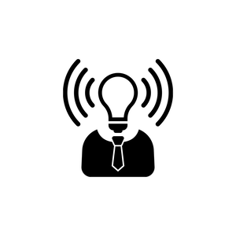

# seo-refactor-homework

[Live Site]()

## Table Of Contents
1. [Description](#description)
2. [Usage](#usage)
3. [Visuals](#visuals)
4. [Authors and Acknowledgement](#authors-and-acknowledgement)

## Description 
- In this assignment I reduced code

## Usage

## Visuals


## Authors and Acknowledgement

```html
<p>Test</p>
```